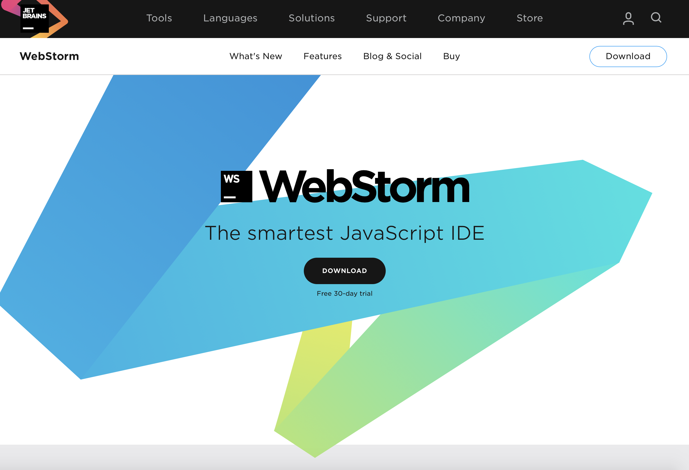
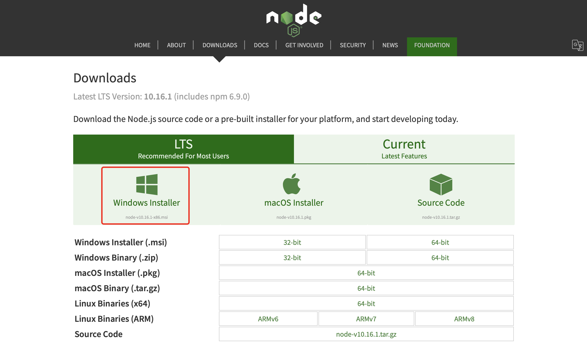
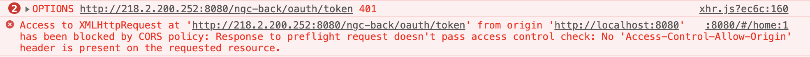
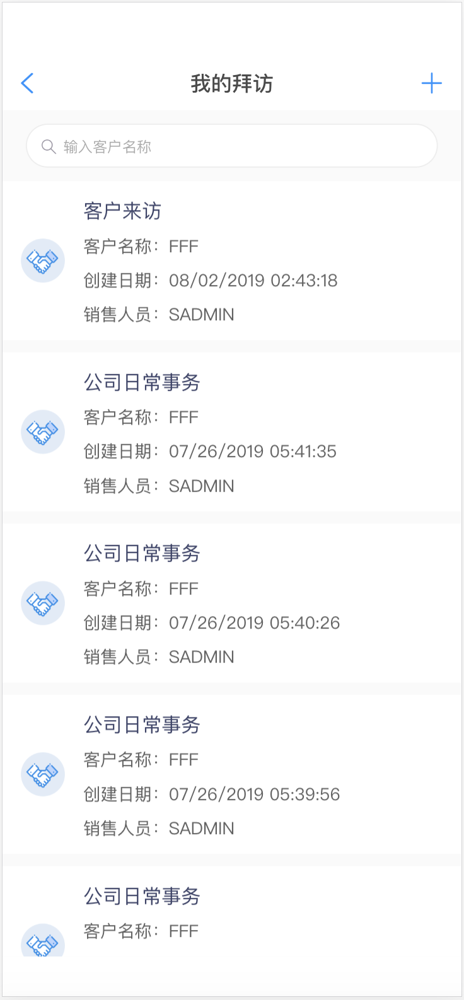
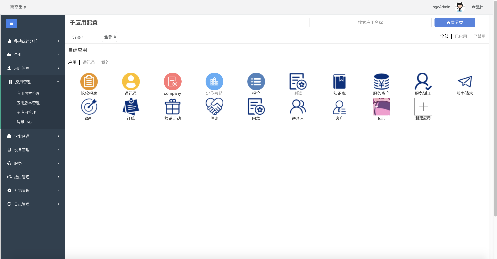
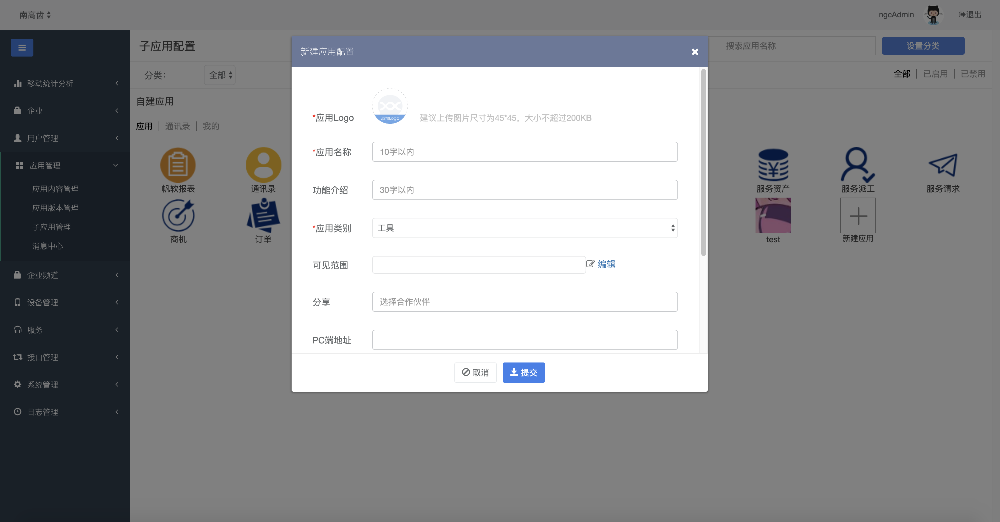
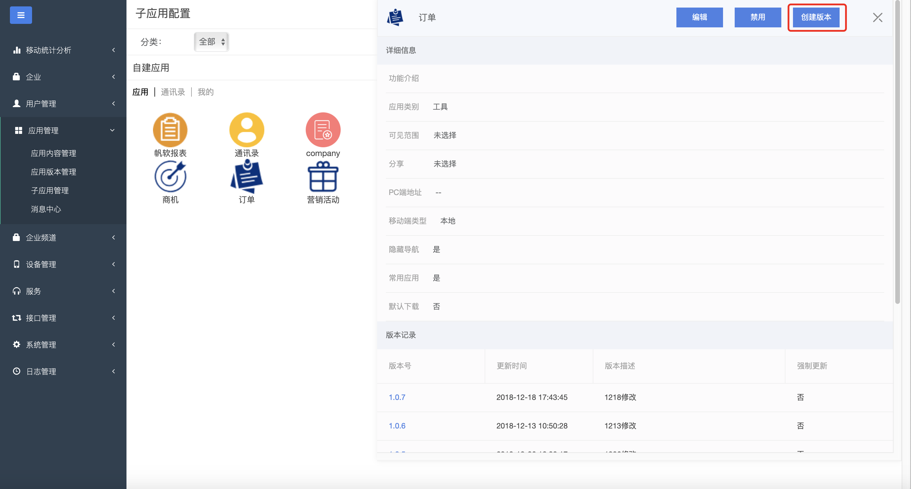
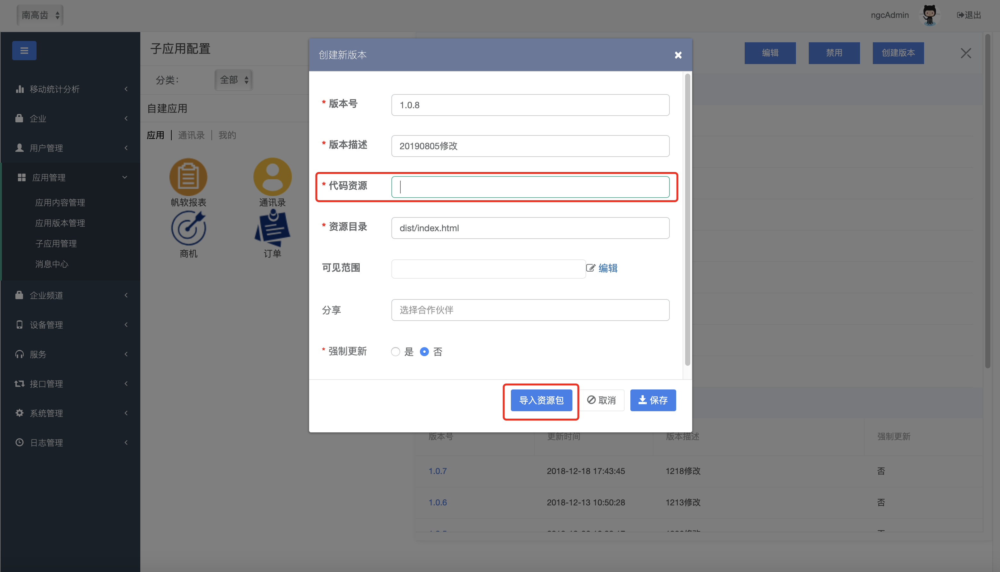

# 海马汇开发快速上手

> 参考文档
>
> [海马汇项目实施文档](http://eco.hand-china.com/doc/hmap-cloud/latest/part5/chapter1.html)
>
> [海马汇项目开发说明](http://hmap.hand-china.com/hippius-docs/init/)
>
> [Hippius UI官方文档](https://hippius.hand-china.com/hippius-docs/ui/)
>
> [Hippius API官方文档](https://hippius.hand-china.com/hippius-api/)

## 你需要做什么

### 没有海马汇之前，开发一个混合APP。你可能需要做以下事情：

- 搭建cordova混合开发环境，安装安卓SDK用来打包安卓应用，找一个苹果电脑用来打包iOS应用。
- 选定一门H5框架进行全应用开发。你除了需要开发标准业务功能，可能还需要开发注册页面、登录页面、个人管理、即时通讯、消息推送、热更新，以及需要搭起整个APP的架子等等。
- 调试原生插件，iOS需要用mac pc进行真机调试。
- 搭一个测试环境安卓、iOS包，至少需要5分钟，或者遇到了问题，可能会更久。
- 随时面临因为代码的不规范性，或者cordova打包的错误操作。导致APP真机运行各种闪退、各种卡死。又苦恼自己不会原生开发，无法定位问题。

### 有了海马汇，你只需要：

- 选定一门H5框架进行上层业务应用开发，底层的基础功能不用再管。
- 开发过程中，在本地chrome上调试。
- 开发完成后，通过海马汇PC工作台新建子应用，并将H5代码上传到服务器。
- 联系[移动中心](mailto:xinming.he@hand-china.com)原生技术私有化打包海马汇到客户的分发平台。`(现阶段，需要联系我们来打包，后面会推出新的打包方式。若是saas交付，则不需要再打包，直接用海马汇公有APP）`
- 进入海马汇APP，直接点开子应用查看运行效果。
- 真机调试，目前还不支持。

## 你还需要知道

- 你需要做的H5开发是以子应用的方式嵌入到海马汇子应用列表中的。
- 点开子应用，打开的其实是原生的webview，即浏览器内核加载你的H5页面。
- 需要知道子应用，在PC工作台如何上传，以及如何设置。
- 子应用目前可以支持在线H5，即将你的H5页面放到web容器中（tomcat、weblogic、nginx等），将你的H5访问链接配置到子应用上；也支持将客户已经有的H5页面链接配置成一个子应用。
- 子应用目前也支持离线H5，即将你的H5页面上传到服务器上。用户使用你的子应用之前会要求先下载你的H5子应用到手机本地，再在本地运行H5代码。`（推荐使用这种方式，体验要好很多，并且支持离线应用场景）`

##环境搭建

1. IDE：`WebStorm`或`VSCode`
2. `NodeJS`
3. Vue脚手架
4. UI组件库：Hippius UI

### WebStorm安装

[WebStorm下载地址](https://www.jetbrains.com/webstorm/)



### NodeJS安装

[NodeJS下载地址](https://nodejs.org/en/download/)



###Vue脚手架安装

[Vue-cli官网](https://cli.vuejs.org/zh/)

> 需提前安装好Node和npm

```bash
npm install -g @vue/cli
# OR
yarn global add @vue/cli
```

创建一个项目

```bash
vue create my-project
# OR
vue ui
```

##海马汇项目初始化

```bash
# 注意将vue cli更新到最新版本，低版本可能报错
# <project_name> 替换成 项目名称
vue init https://rdc.hand-china.com/gitlab:hmap-cloud-develop/hippius-vue-init <project_name> -c

? Project name hippius-demo
? Project description A Vue.js project
? Author leytonliu <lidong.liu@hand-china.com>
? Install vuex? Yes
? Install i18n plugin? Yes
? Setup unit tests (use Jest) and e2e tests (use Nightwatch)? Yes
? Pick a platform hmap
   vue-cli · Generated "hippius-demo".
   
# 初始化完成后进入项目文件夹
cd hippius-demo

# install dependencies
yarn

# 安装 chromedriver 可能会报错，源镜像被墙了，换成淘宝镜像
yarn config set chromedriver_cdnurl https://npm.taobao.org/mirrors/chromedriver

# serve with hot reload at localhost:8080
yarn start | yarn run dev

```

## 项目结构

```bash
.
├── build												# 项目打包配置文件
├── config											# 项目环境配置文件
├── node_modules								# 项目依赖
├── src													# 主目录
│   ├── api											# 存放与接口调用相关的资源
│   ├── assets									# 存放项目中需要应用的资源
│   │   ├── fonts								# 字体资源
│   │   ├── images							# 图片资源
│   │   └── stylus							# 全局通用的Stylus样式资源
│   ├── components							# 存放项目中用到的vue组件(非路由组件)
│   ├── data										# 存放项目中需要用到的配置数据
│   ├── i18n										# 存放国际化处理的数据文件
│   ├── libs										# 存放一些无法通过npm安装的第三方库
│   ├── platform								# 海马汇平台的一些插件
│   ├── router									# 存放vue-router的相关配置
│   │   ├── router.js						# 存放vue-router的所有router配置
│   ├── store										# 存放vuex状态管理的相关配置
│   │   ├── modules						  # 按模块分隔store配置，如果所有模块通用可写在index.js
│   ├── utils										# 存放全局共享的工具函数
│   │   ├── http								# 存放对axios的一些加工处理
│   │   ├── directives.js 			# 存放全局的vue-directive
│   │   ├── filter.js						# 存放全局的vue-filter
│   ├── views										# 存放项目的所有页面展示组件(路由组件)
│   ├── App.vue									# 主组件文件
│   └──  main.js								# 入口js文件
├── static											# 静态资源文件夹
├── test												# 测试工具
```

##海马汇Hippius UI

在海马汇应用中UI组件首选[Hippius UI](http://hmap.hand-china.com/hippius-docs/ui/)

### 安装

```bash
yarn add https://rdc.hand-china.com/gitlab/hmap-cloud-develop/hippius-vue-ui.git
```

### 配置

```json
// build/webpack.base.conf.js 
// 找到 module 中 test: /\.js$/
// include 在最后添加 resolve('node_modules/hippius/packages')
      {
        test: /\.js$/,
        loader: 'babel-loader',
        include: [
          resolve('src'),
          resolve('test'),
          resolve('node_modules/webpack-dev-server/client'),
          resolve('node_modules/hippius/packages')
        ]
      }
```

```javascript
// 在main.js中引入hippius组件
import {HView, HHeader, HContent, Scroll, Swipe, HButton, Spin, AlertPlugin, ConfirmPlugin, PromptPlugin, Loading, Toast, Notify, TopTip, Group, Check} from 'hippius'
const { SwipeItem } = Swipe
Vue.use(AlertPlugin)
Vue.use(ConfirmPlugin)
Vue.use(PromptPlugin)
Vue.component('HView', HView)
Vue.component('HHeader', HHeader)
Vue.component('HContent', HContent)
Vue.component('Scroll', Scroll)
Vue.component('Swipe', Swipe)
Vue.component('SwipeItem', SwipeItem)
Vue.component('HButton', HButton)
Vue.component('Spin', Spin)
Vue.component('Loading', Loading)
Vue.component('Toast', Toast)
Vue.component('Notify', Notify)
Vue.component('TopTip', TopTip)
Vue.component('Group', Group)
Vue.component('Check', Check)
```

##跨域问题

###未跨域获取token失败



`Access-Control-Allow-Origin`为跨域问题

### 解决方案

1. 修改`src/util/http/interceptors.js`

   ```javascript
   // 请求之前的预处理函数
   const requestBefore = request => {
     #注释此处
     // if (window.localStorage.token) {
     //   request.headers.common.Authorization = `Bearer ${window.localStorage.token}`
     // }
     return request
   }
   
   // 请求时出错的处理函数
   const requestError = error => Promise.reject(error)
   
   // 请求返回之后的预处理函数：若返回状态码为200，但实际请求未完成，将异常处理统一到错误处理
   #注释此处
   // const responseAfter = response => response.data.success ? response.data : Promise.reject(response)
   // 若项目接口无 response.data.success 状态字段，注释上一行，使用下行
   #还原此处
   const responseAfter = response => response
   
   // 状态码信息
   const codeMessage = {
     200: '服务器成功返回请求的数据。',
     201: '新建或修改数据成功。',
     202: '一个请求已经进入后台排队（异步任务）。',
     204: '删除数据成功。',
     400: '发出的请求有错误，服务器没有进行新建或修改数据的操作。',
     401: '用户没有权限（令牌、用户名、密码错误）。',
     403: '用户得到授权，但是访问是被禁止的。',
     404: '发出的请求针对的是不存在的记录，服务器没有进行操作。',
     406: '请求的格式不可得。',
     410: '请求的资源被永久删除，且不会再得到的。',
     422: '当创建一个对象时，发生一个验证错误。',
     500: '服务器发生错误，请检查服务器。',
     502: '网关错误。',
     503: '服务不可用，服务器暂时过载或维护。',
     504: '网关超时。',
   }
   // 检查状态
   const checkStatus = response => {
     if (response.status >= 400) {
       const errorMessage = codeMessage[response.status] || response.statusText
       alert(`请求错误 ${response.status}: ${errorMessage}`)
     }
   }
   
   // 请求返回时出错的处理函数
   const responseError = error => {
     if (error && error.response) {
       checkStatus(error.response)
     }
     return Promise.reject(error)
   }
   
   export { requestBefore, requestError, responseAfter, responseError }
   ```
   

##开发指南

下面将用简单的例子阐述在项目中是如何编写、添加、发布一个子应用。



###添加组件

> 在/src/views下新建一个文件夹，根据业务含义取名为Dairy，新建一个Vue Component文件，命名为dairy.vue

```html
<!-- 列表的页面结构
<template>
	<HView>
		<HHeader></HHeader>
		<HContent>
			<scroll>
					<item>...</item>
					<item>...</item>
					...
			</scroll>
		</HContent>
	</HView>
</template>
-->
<template>
    <HView :fullScreen="true">
        <HHeader>
            <div slot="left" class="hips-header-btn" @click="goBack">
                
            </div>
            <div slot="center">我的拜访</div>
            <div slot="right" class="hips-header-btn" @click="add">
                
            </div>
        </HHeader>
        <HContent :scrollY="false">
            <div class="searchInput">
                <input type="search"
                       placeholder="输入客户名称"
                       class="text-input"
                       v-model="query.keyword"
                       autocomplete="off">
            </div>
            <no-data class="no-data-class" type="no-data" v-if="lineList.length===0"></no-data>
            <scroll class="list-scroll"
                    :scrollY="true"
                    :pullDown="pullDown"
                    :pullUp="pullUp"
                    ref="scroll"
                    :autoUpdate="true"
                    @pullingDown="loadRefresh"
                    @pullingUp="loadMore">
                <div class="diary-list" v-for="(i,index) in lineList">
                    <div class="business-item" @click="goDetail(i)">
                        
                        <div class="right">
                            <span class="title">{{i.WorkType}}</span>
                            <span class="desc">客户名称：{{i.Account}}</span>
                            <span class="desc">创建日期：{{i.CreatedTime}}</span>
                            <span class="desc">销售人员：{{i.PrimaryEmployee}}</span>
                        </div>
                    </div>
                </div>
            </scroll>
        </HContent>
    </HView>
</template>
```

```javascript
<script>
    import {fetchSomething} from 'api/home'
    export default {
        name: 'dairy',
        data () {
            return {
                num: 1,
                pullDown: true,
                pullUp: true,
                showBox: false,
                canLeave: false,
                menus: [
                    '我的拜访',
                    '全部拜访'
                ],
                lineList: [],
                query: {
                    keyword: ''
                }
            }
        },
        activated () {
            const _this = this
            _this.canLeave = false
            _this.getWorkLog()
        },
        deactivated () {
            const _this = this
            _this.lineList = []
            _this.query.keyword = ''
            _this.num = 1
        },
        methods: {
            goBack () {
                const _this = this
                cordova.exec(null, null, 'BridgePlugin', 'closeWebView')
            },
            add () {
                const _this = this
                _this.canLeave = true
                _this.$router.pushPage({
                    name: 'diaryAdd',
                    params: {source: 'diary'}
                }, true)
            },
            loadRefresh () {
                const _this = this
                _this.num = 1
                _this.getWorkLog()
            },
            loadMore () {
                const _this = this
                _this.num += 1
                _this.getWorkLog()
            },
            //获取工作日志
            async getWorkLog () {
                const _this = this
                _this.$vux.loading.show({text: '加载中'})
                let params,
                    url = `${$config.basePath}workLogQueryInterfaceServiceQueryWorkLog&organizationId=${window.localStorage.getItem('organizationId')}`
                params = {
                    'cus:NGCWorkLogQueryInterfaceServiceQueryWorkLog_Input': {
                        'cus:Account': _this.query.keyword,
                        'cus:PageNumber': _this.num,
                        'cus:PageSize': 10,
                        'cus:ViewMode': 'Personal'
                    },
                }
                console.log(url)
                try {
                    if (_this.num === 1) {
                        _this.lineList = []
                    }
                    let res = await fetchSomething(url, params)
                    console.log(res)
                    console.log(JSON.stringify((res.data)))
                    if (res.status === 200) {
                        let Diary = _this.jsonArray(res.data['SOAP-ENV:Envelope']['SOAP-ENV:Body']
                            ['ns:NGCWorkLogQueryInterfaceServiceQueryWorkLog_Output']
                            ['ListOfNgcWorkLogQueryIo']['NgcWorkLog'])
                        if (Diary.length > 0) {
                            if (_this.num === 1) {
                                _this.lineList = Diary
                            } else {
                                _this.lineList = _this.lineList.concat(Diary)
                            }
                            if (_this.num == res.data['SOAP-ENV:Envelope']['SOAP-ENV:Body']
                                    ['ns:NGCWorkLogQueryInterfaceServiceQueryWorkLog_Output']['ns:TotalNumber'] ||
                                '0' == res.data['SOAP-ENV:Envelope']['SOAP-ENV:Body']
                                    ['ns:NGCWorkLogQueryInterfaceServiceQueryWorkLog_Output']['ns:TotalNumber']) {
                                _this.$refs.scroll.update(true)
                                console.log('上拉加载到了最底部')
                            } else {
                                _this.$refs.scroll.update(false)
                            }
                            //_this.lineList = _this.lineList.concat(Custom);
                            console.log('列表数据长度', _this.lineList.length)
                            _this.$vux.loading.hide()
                        } else {
                            _this.$vux.loading.hide()
                            _this.$refs.scroll.update(false)
                            _this.$vux.toast.text('暂无数据')
                        }
                    } else {
                        _this.$vux.loading.hide()
                        _this.$refs.scroll.update(false)
                        _this.$vux.toast.text('网络异常')
                    }
                } catch (e) {
                    console.log('异常', e)
                    _this.$refs.scroll.update(false)
                    _this.$vux.loading.hide()
                    _this.$vux.toast.text('获取数据失败')
                }

            },
            goDetail (item) {
                console.log('跳转详情页：')
                console.log(item)
                const _this = this
                _this.canLeave = true
                _this.$router.pushPage({
                    name: 'diaryDetail',
                    params: {
                        item: item,
                        source: 'diary',
                    },
                }, true)
            }
        }
    }
</script>
```

```stylus
<style lang="stylus" scoped>
    .diary-list {
        width: 100%;
        .business-item {
            position: relative;
            height: 130px;
            background-color: #FFFFFF;
            margin-top: 10px;
            img {
                position: absolute;
                top: 47px;
                left: 15px;
                width: 36px;
                height: 36px;
            }
            .right {
                display: flex;
                flex-direction: column;
                margin-left: 66px;
                .title {
                    margin-top: 15px;
                    color: #3D4269;
                    font-size: 16px;
                }
                .desc {
                    color: #616161;
                    font-size: 14px;
                    margin-top: 12px;
                }
            }
        }
    }
    .diary-item {
        margin-bottom: 10px;
    }
    .h-button {
        width: 100%;
        .hbutton {
            width: 100%;
            height: 48px;
            background-color: #FFF;
            font-size: 15px;
            color: #333333;
        }
    }
    .h-button::after {
        content: '';
        display: block;
        position: absolute;
        background: #eee;
        left: 0;
        /*bottom: 0;*/
        width: 100%;
        height: 1px;
        /*transform: scaleY(0.5);*/
        -webkit-transform-origin: 0 bottom;
        transform-origin: 0 bottom;
    }
</style>

```


###配置路由

编写完一个Vue的路由组件后，需要配置路由

> 在/src/router/modules下新建一个dairy.js文件

```js
import Diary from '@/views/Diary/diary'

const routes = [
    {
        path: '/Diary/diary',
        name: 'diary',
        meta: {
            index: 1,
            keepAlive: true,
        },
        component: Diary,
    },
]

export default routes
```

> 在/src/router/router.js中引入diary.js

```javascript
import diary from './modules/diary'
export default [
    ...dairy
]
```

### 编译运行

在`termimal`中输入`yarn start`之后，在浏览器中输入`http://localhost:8080/#/dairy`就能访问到刚刚做的新模块了

## 打包发布

> 在本地经过测试后需要打包发布到开发环境或测试环境，打包命令可以用`npm run build`在当前目录下生成一个`dist`文件夹，将其压缩成dist.zip准备发布

```bash
# 打包生成
npm run build
```

> 登陆海马汇中台，在应用管理-子应用管理下-新建应用



> 新建一个子应用需要上传应用logo，应用名称等基础信息



> 选中某个子应用➔创建版本



> 创建版本➔导入资源包(自动填写代码资源)➔版本号➔版本描述➔资源目录(dist/index.html)➔强制更新(否)



> 保存后即完成了发版操作，可以在APP中查看到新增的模块了

